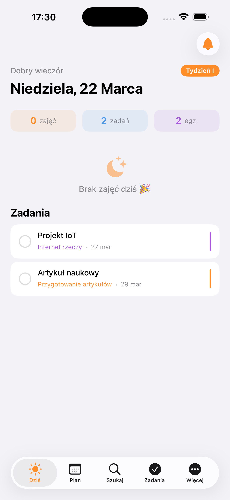
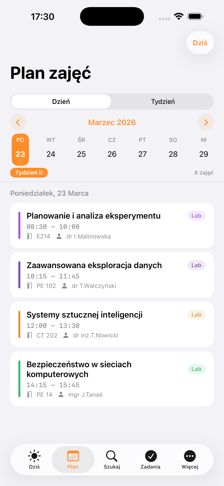
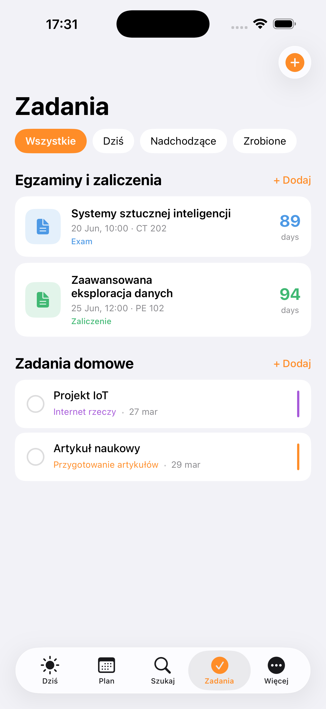
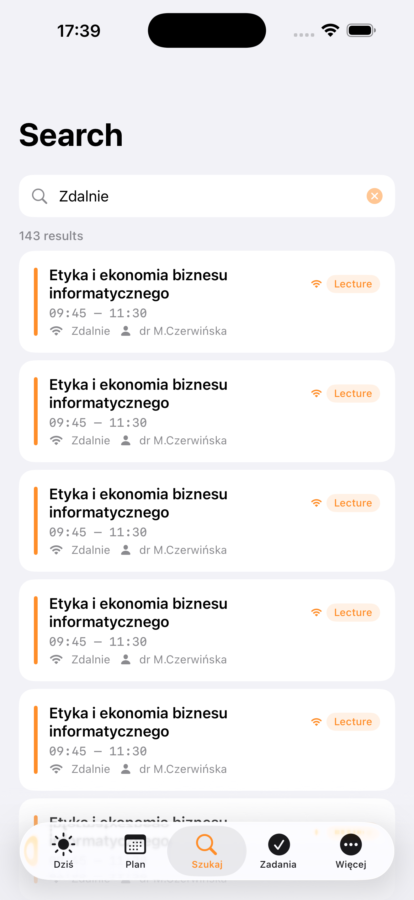

# UniPlan 📅

**Student planner for Politechnika Lubelska — I2S gr. 2/3**

A native iOS app built with SwiftUI that provides a clean, fast and intuitive way to manage your university schedule, tasks and exams.

---

## Screenshots

<p align="center">
  
  
  
  
</p>

---

## Features

### 📆 Schedule
- Full semester timetable loaded automatically (I2S gr. 2/3, semestr letni 2025/2026)
- Week I / Week II alternating schedule with correct academic calendar
- Free days and public holidays marked in red (Easter, Labour Day, Corpus Christi, etc.)
- Day view and Week view
- Swipe left/right to navigate between days
- Remote classes clearly marked with Wi-Fi indicator

### ✏️ Edit & Personalise
- Tap any class to see details, add a task or edit the entry
- Long-press (context menu) to edit room, lecturer, time or delete
- Deleted classes can be restored from Settings

### ✅ Tasks
- Add tasks directly from a class card — subject name pre-filled automatically
- Swipe left to delete, tap checkbox to complete
- Filter by: All / Today / Upcoming / Done
- All tasks saved persistently between app launches

### 📝 Exams & Credits
- Add, edit and delete exams and zaliczenia
- Choose subject, type (Egzamin / Zaliczenie / Kolokwium), room, date, time and colour
- Countdown in days shown on each exam card
- Data saved persistently between app launches

### 🔔 Notifications
- Local push notifications before each class
- Configurable reminder time (5–30 minutes before)
- Set up during onboarding or in Settings

### 🎨 Design
- Clean iOS-native design with orange accent colour
- Supports Light and Dark mode
- Smooth animations and intuitive gestures

---

## Tech Stack

| | |
|---|---|
| **Language** | Swift 5.9 |
| **UI Framework** | SwiftUI |
| **Minimum iOS** | iOS 17.0 |
| **Architecture** | MVVM + ObservableObject |
| **Persistence** | UserDefaults (JSON) |
| **Notifications** | UserNotifications framework |
| **Schedule data** | Hardcoded from official ICS export (planzajec.pollub.pl) |

---

## Project Structure

```
UniPlan/
│
├── UniPlanApp.swift
├── ContentView.swift
│
├── Models/
│   ├── Models.swift              # ClassItem, ExamItem, TaskItem, Color+Hex
│   └── HardcodedSchedule.swift   # 295 classes for I2S gr.2/3 sem. letni 2025/26
│
├── Views/
│   ├── TodayView.swift           # Today screen with current/next class
│   ├── ScheduleView.swift        # Day + Week view with holiday markers
│   ├── OtherViews.swift          # Search, Tasks, More/Settings
│   ├── ExamViews.swift           # Add/edit exams sheet
│   ├── ImportView.swift          # ICS import browser
│   ├── OnboardingView.swift      # First-launch onboarding
│   └── AppIconView.swift         # App icon preview
│
├── Components/
│   └── Components.swift          # ClassCard, TaskRow, ExamCard, WeekDaySelector
│
└── Services/
    ├── ScheduleStore.swift       # Schedule state + week I/II logic + free days
    ├── Stores.swift              # TaskStore + ExamStore with persistence
    ├── ICSParserService.swift    # ICS file parser for PL university format
    └── NotificationManager.swift # Local notifications scheduler
```

---

## Getting Started

### Requirements
- macOS 14+ with Xcode 16+
- iPhone with iOS 17.0+
- Free Apple ID (for running on device)

### Run locally

```bash
git clone https://github.com/lilyhurko/UniPlan.git
cd UniPlan
open UniPlan.xcodeproj
```

Then select your iPhone or a simulator and press **▶ Run** (`Cmd+R`).

### First launch
On first launch the onboarding screen will appear. You can enable push notifications there or later in the **Więcej** tab.

---

## Academic Calendar

The app includes the official Politechnika Lubelska academic calendar for semester letni 2025/2026 with correct Week I / Week II alternation and all public holidays.

| Holiday | Date |
|---|---|
| Wielki Czwartek | 02.04.2026 |
| Wielki Piątek | 03.04.2026 |
| Wielkanoc | 04–05.04.2026 |
| Poniedziałek Wielkanocny | 06.04.2026 |
| Tydzień Wielkanocny | 07–08.04.2026 |
| Święto Pracy | 01.05.2026 |
| Wniebowstąpienie Pańskie | 13.05.2026 |
| Boże Ciało | 04.06.2026 |

---

## Author

**Liliia Hurko**
Politechnika Lubelska — Informatyka, I2S gr. 2/3
Semestr letni 2025/2026

---

## License

This project is for personal and educational use only.
Schedule data © Politechnika Lubelska.
